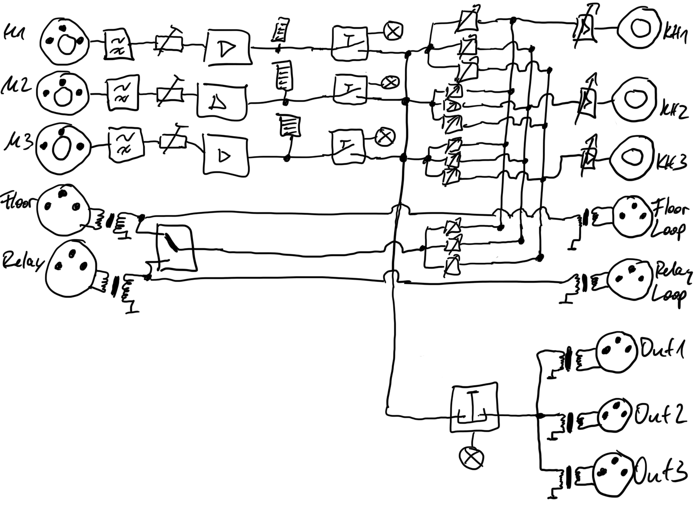

# lingobox

Die geplante Lingobox ist eine Open-Source-Hardware-Dolmetschereinheit.
Die Dolmetscher erhalten das Original-Signal zum Hören und am Ausgang der Box kommt das pure Audio-Signal der Übersetzer heraus.

Handelsübliche Translator-Einheiten kosten eine Menge Geld und sehen z.B. so aus:  
* [JTS IT-12D, auch als Enersound IC-12 verkauft](https://www.jts-europe.de/produkte/installation/dolmetscher-systeme/it-12d) ~850€
* [Williams Sound IC-2](https://www.williamssound.com/catalog/ic-2) ~1500€
* [Shure MXCIC Interpreter Console](https://www.shure.com/en-US/products/conference-discussion/mxc/mxcic) ~1800€
* [Riedel CCP-1116 commentary unit](https://www.riedel.net/en/products/intercom/intercom-panels/commentary) ~15000€

## Anforderungen
### Audio
* 2 (oder 3) Inputs Mikrofon große Klinke verriegelt kombiniert mit XLR; dynamisch/Elektret/Kondensator
Sich auf einen Speisetyp festzulegen würde es deutlich einfacher machen.
Ich würde für dynamisches Headset plädieren, da keine Probleme mit Speisespannung und knackfreie Mutes easy gehen.
Außerdem sind sie übersteuerungsfester und unverwüstlich.
* Trittschallfilter für alle Mikroeingänge
* Mono-Input Floor/Stage XLR +6dBu trafosymmetriert, galvanisch getrennt
* Mono-Input Relay(bereits übersetzte pure Sprache - meist englisch - mit der alle anderen weiter übersetzen) XLR +6dBu trafosymmetriert, galvanisch getrennt
* Mono-Output Floor/Stage-Durchschliff XLR +6dBu trafosymmetriert, galvanisch getrennt für Daisychaining von mehreren Boxen
* Mono-Output Relay-Durchschliff XLR +6dBu trafosymmetriert, galvanisch getrennt für Daisychaining von mehreren Boxen
* 3 Outputs Summe Translator XLR +6dBu trafosymmetriert, galvanisch getrennt; alle Sprecher zusammen gemischt; z.B. für Übergabe VOC-Recording, Monitoring/Recording und Relaying
* 2 (oder 3) Mischstufen jeweils separat: Mic 1, Mic 2, (Mic 3,) Floor/Relay; Gesamtlaustärke
* 2 (oder 3) Outputs Kopfhörer große Klinke verriegelt; mono und stereo (doppelmono)

### Schalten und Stellen
* OnAir-Schalter (Aus/Ein) für jedes Mikro knackfrei mit Signalisation
* 1 Große Räusper-Taste (Ein/Aus) knackfrei mit Signalisation
* Pegel-Anzeige pro Mikro-Input, um Übersteuerungen zu vermeiden
* "schwer" zugänglicher Regler für Vorverstärkung jedes Mikros
* Wahlschalter Floor oder Relay
* Gesamtlaustärke pro Kopfhörer
* Lautstärke Mic 1 und Mic 2 (und Mic 3) und Floor/Relay pro Kopfhörer

### Signalisation
* Signalisation zum VOC und vom VOC über 1x 4pol-XLR (5V hin/her)
* Externe On-Air-Leuchte über einen separaten 4pol-XLRw (5V Output)
* „Slow-Down“-Signalisation über einen separaten 4pol-XLRw (5V Output)

Man hängt an den Output eine LED mit Vorwiderstand dran und fertig. Noch einfacher ist eine Fahrradlampe, an die man einen 4pol XLR-Stecker anlötet. Du kannst dort jede Leuchte dran hängen, die über ein USB-Netzteil gespeist wird und tauscht einfach den USB-Stecker gegen XLR aus.

### Diverses
* EMV-geschützt
* Nieder-Wechselspannungsversorgung über verriegelbaren Anschluß mit __Trafo__-Netzteil

### Spätere Features
* Integriertes Recording
* Auto-Ducking

Das ganze würde sich ohne ein Stück Software diskret aufbauen lassen und könnte von jedem Löter repariert werden.

## Diskussion: Wahl des Headsets/Mikrofons
Man sollte sich vorher auch Gedanken machen, welche Headsets in Frage kommen.
* Ich würde für __dynamische Headsets__ plädieren und die sollten, nach meiner Meinung, mit einer __Kugelkapsel__ ausgestattet sein.
Dann fällt die unterschiedliche Positionierung der Headsets bei den Sprechern nicht so auf, durch Fehlen des massiven Nahbesprechungseffekts bei Headsets (stark schwankende Bässe) und Fehlen von Fehlwinkel (jede Einsprechrichtung erzeugt immer denselben Pegel am Ausgang).
* Gegenmeinung: __Mikro__ und __Kopfhörer getrennt__. Was wohl auch ok wäre, wäre ein Bügelmikrofon oder so, dass man eigene Kopfhörer einfach "drüber" ziehen kann, aber bisher sind wir mit Schwanenhals z.B. an der Konsole, oder separatem Mikro mit Ständer gut gefahren. Du trägst die Kopfhörer ggf. recht lange und willst was, was zu deinen Ohren passt.
